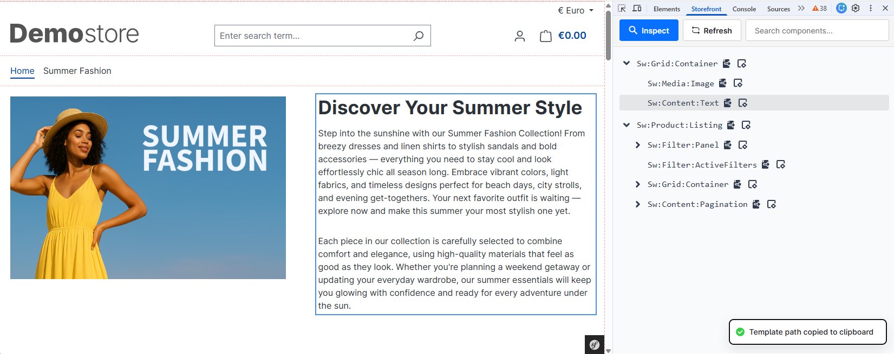

# Shopware Storefront Chrome Extension



This is an experimental chrome extension for the new componente system of the Shopware Storefront. It allows you to analyse the Twig component structure of the page and inspect corresponding elements.

This feature is still under development. If you want to learn more about the new content system in Shopware you can find more information in this [GitHub discussion](https://github.com/shopware/shopware/discussions/13806).

## Installation

### Setup

```bash
npm install
```

### Build

Build the extension for production:

```bash
npm run build
```

### Loading the Extension

1. Open Chrome and go to `chrome://extensions/`.
2. Enable "Developer mode".
3. Click "Load unpacked".
4. Select the `dist/` folder of the project.
